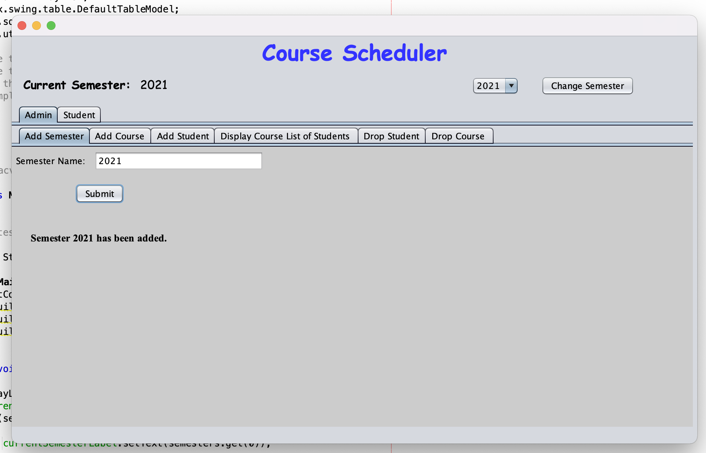
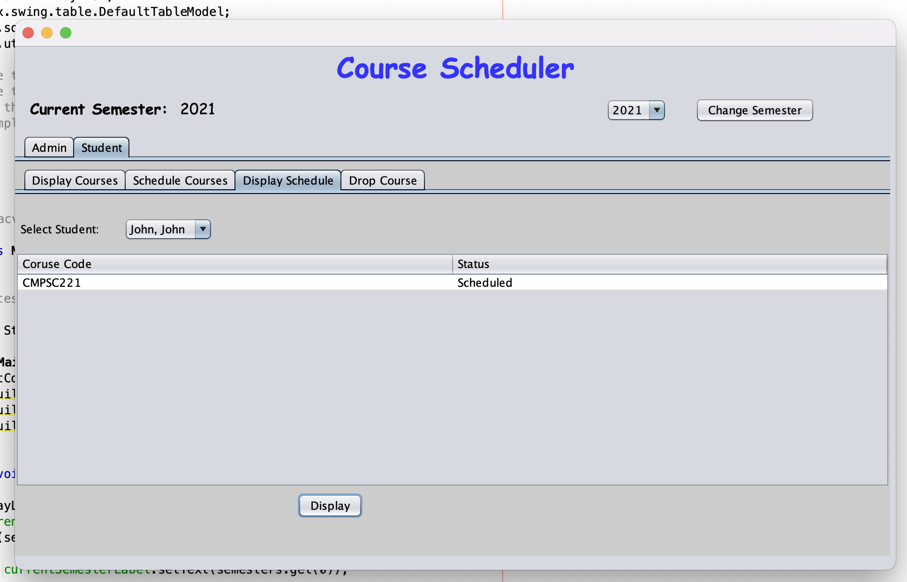
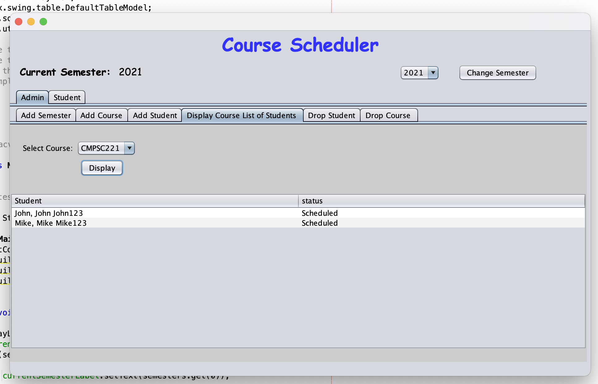
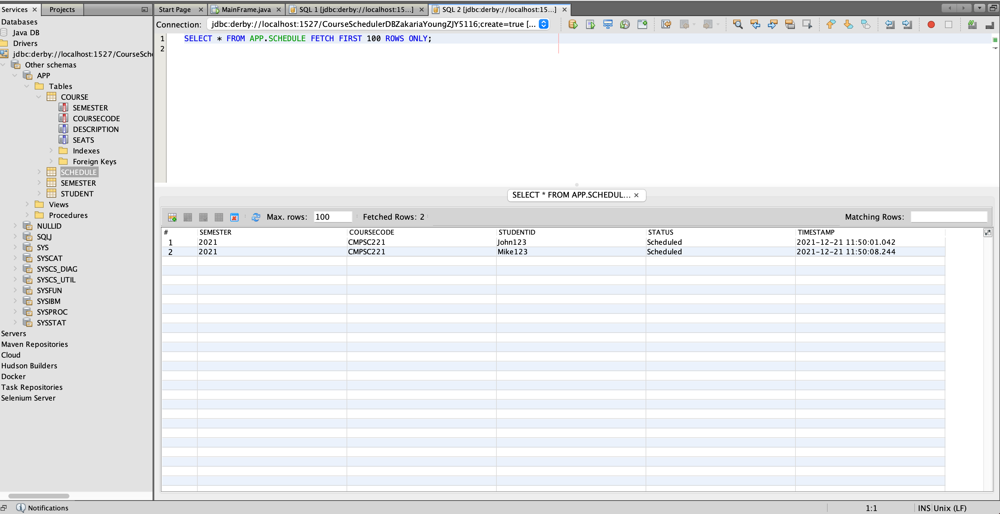

# Course-Scheduler-GUI
This project is a course scheduling GUI that is backed by a database that has functionality for both the admin and the student. For this program we implemented Three-tier architecture allowing for this project to be easily scaled. We have 3 different types of classes in this project. The queries classes which directly modify data stored in the database. The Entry classes which takes in data from the GUI and create objects that are either Courses, Semesters, or Students. Finally we have the GUI which creates objects using the entry classes and then passes data into the database when needed.

Some images from the GUI:

